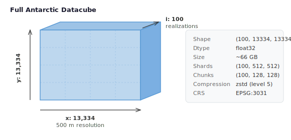
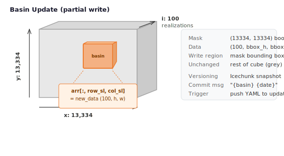
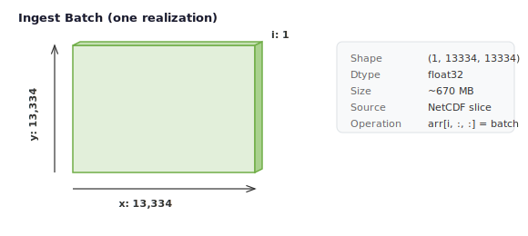
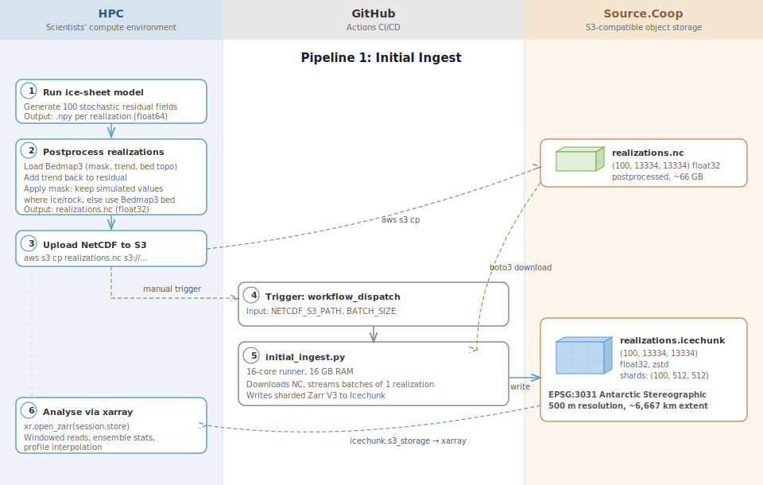
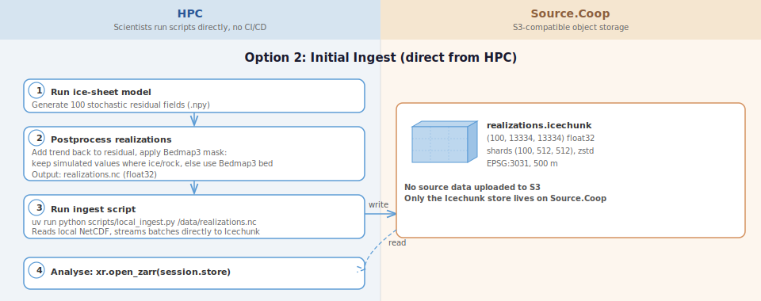
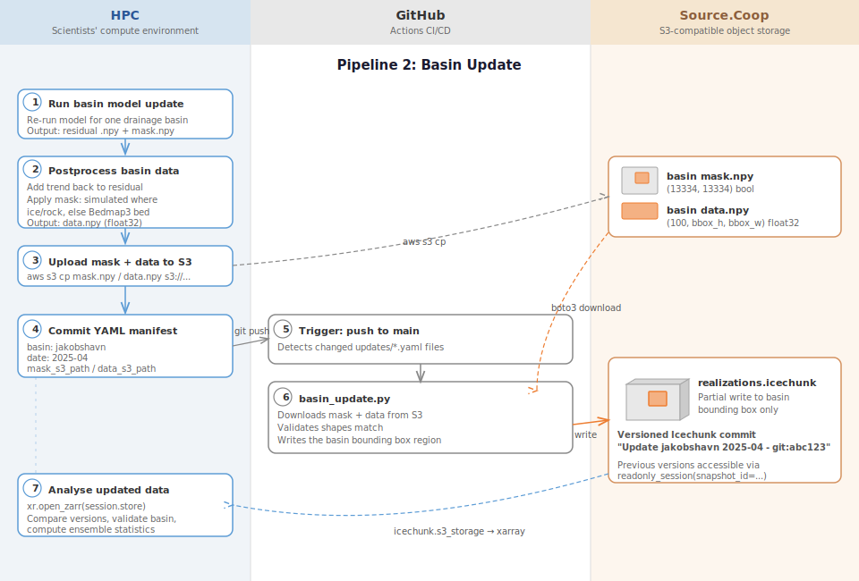
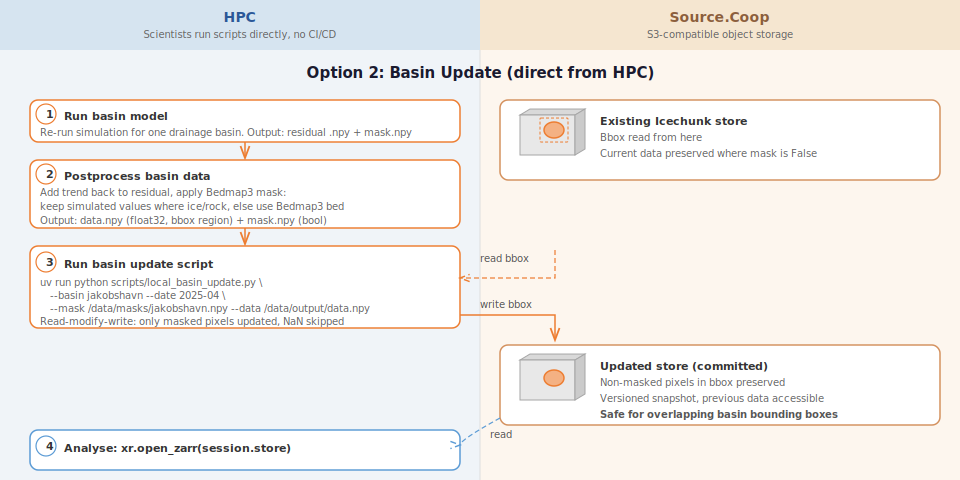
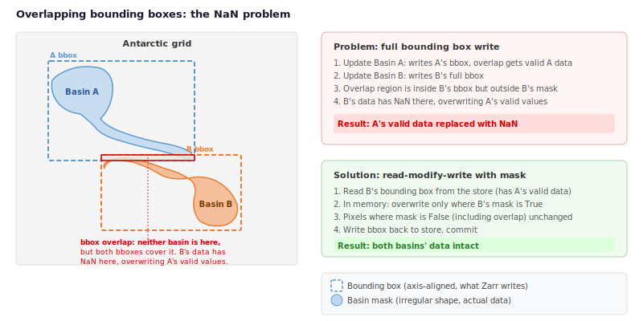

# Data Pipeline

## Datacube

The pipeline produces a sharded Zarr V3 datacube in an Icechunk store on [Source.Coop](https://source.coop/englacial/demogorgn):

<p align="center">
  
</p>

Basin updates write only the bounding box of a drainage basin, replacing that spatial region across all 100 realizations:

<p align="center">
  
</p>

---

## Initial Ingest

One-time ingestion of the full Antarctic ice-sheet datacube. Raw model output (residual fields) is postprocessed on HPC before ingestion: the Bedmap3 trend is added back to each residual, and a mask is applied to keep simulated values where ice or rock is present and use the original Bedmap3 bed topography elsewhere.

Each batch is a single realization slab streamed into the store:

<p align="center">
  
</p>

### Current design: GitHub Actions

The postprocessed NetCDF is uploaded to S3, then the workflow is triggered manually.

<p align="center">
  
</p>

### Alternative design: direct from HPC

Scientists run the ingest script directly on HPC. The NetCDF stays on the local filesystem and is streamed to the Icechunk store on Source.Coop without an intermediate S3 upload.

<p align="center">
  
</p>

---

## Basin Update

Incremental update replacing a single drainage basin's spatial region across all realizations. Raw basin model output is postprocessed on HPC (add trend, apply Bedmap3 mask) before the update is applied.

### Current design: GitHub Actions

The postprocessed mask and data are uploaded to S3. A YAML manifest is committed to `updates/`, which triggers the workflow automatically, or it can be triggered manually via workflow_dispatch.

<p align="center">
  
</p>

#### YAML manifest format

```yaml
basin: jakobshavn
date: "2025-04"
mask_s3_path: "s3://us-west-2.opendata.source.coop/englacial/demogorgn/masks/jakobshavn.npy"
data_s3_path: "s3://us-west-2.opendata.source.coop/englacial/demogorgn/model-output/jakobshavn/2025-04/data.npy"
```

Commit the manifest to `updates/` on the `main` branch. The workflow detects changed YAML files and passes them to `basin_update.py`.

### Alternative design: direct from HPC

Scientists run the update script directly on HPC, pointing it at local mask and data files. The script uses **read-modify-write**: it reads the current bounding box from the store, overwrites only the pixels inside the basin mask in memory, then writes the bounding box back. This means NaN values outside the basin are never written to the store.

<p align="center">
  
</p>

---

## Handling NaN values in overlapping bounding boxes

Model output contains valid data only within the basin mask. Pixels outside the mask but inside the bounding box are NaN. When neighbouring basins have overlapping bounding boxes, writing the full bbox can overwrite valid data from a previously updated basin with NaN.

<p align="center">
  
</p>

Icechunk's versioning means the data is never truly lost (the previous snapshot is preserved and accessible via `readonly_session(snapshot_id=...)`), but the latest version would be incorrect. A **read-modify-write** with the basin mask avoids this: only pixels where the mask is `True` are updated, so NaN values outside the basin are never written to the store.

!!! note
    The current GitHub Actions pipeline writes the full bounding box and is susceptible to this issue. The alternative design's read-modify-write approach handles this correctly by skipping NaN pixels outside the mask.

---

## Updating a single realization

The standard basin update writes all 100 realizations for a spatial region. To update a single realization (e.g. re-running one seed with corrected parameters), the write targets a single slice along the `i` dimension:

```python
# Standard basin update (all realizations):
arr[:, row_sl, col_sl] = new_data          # shape (100, bbox_h, bbox_w)

# Single-realization update:
arr[42, row_sl, col_sl] = new_data         # shape (bbox_h, bbox_w)
```

### Chunking implications

The store uses shards of `(100, 512, 512)` with inner chunks of `(100, 128, 128)`. All 100 realizations share the same chunk along the `i` dimension. This means writing a single realization still requires Zarr to read and rewrite the full chunk containing all 100 realizations for every spatial chunk that overlaps the bounding box. There is no I/O saving compared to updating all 100 realizations at once for the same spatial region.

A single-realization update is useful when:

- One realization had a bad seed or incorrect parameters and needs to be re-run
- A new model version produces a corrected output for a specific realization
- Quality control flags a single realization for replacement

It is **not** more efficient than a full basin update for the same spatial extent.

### With the current design (GitHub Actions)

The YAML manifest would include a `realization` field:

```yaml
basin: jakobshavn
date: "2025-04"
realization: 42
mask_s3_path: "s3://...masks/jakobshavn.npy"
data_s3_path: "s3://...model-output/jakobshavn/2025-04/realization_42.npy"
```

The `data.npy` would have shape `(bbox_h, bbox_w)` instead of `(100, bbox_h, bbox_w)`, and `basin_update.py` would write to `arr[realization, row_sl, col_sl]` instead of `arr[:, row_sl, col_sl]`.

### With the alternative design (direct from HPC)

The update script would accept a `--realization` flag:

```bash
uv run python scripts/local_basin_update.py \
    --basin jakobshavn \
    --date 2025-04 \
    --realization 42 \
    --mask /data/masks/jakobshavn.npy \
    --data /data/output/realization_42.npy
```

The read-modify-write logic is the same, but sliced to a single realization:

```python
mask_bbox = basin_mask[row_sl, col_sl]

# Read single realization's bounding box
current = arr[realization, row_sl, col_sl]

# Overwrite only masked pixels
current[mask_bbox] = new_data[mask_bbox]

# Write back
arr[realization, row_sl, col_sl] = current
```

---

## Updating masks

The pipeline uses two types of masks, both of which may need to be updated over time.

### Bedmap3 classification mask

The Bedmap3 mask (`ds.mask`) classifies each grid cell as ice (1), rock (2), or other surface types (4, etc.). During postprocessing, this mask determines where simulated bed topography values are used vs where the original Bedmap3 bed is kept:

```python
ice_rock_msk = (mask == 1) | (mask == 4) | (mask == 2)
tmp_bed = np.where(ice_rock_msk, simulated_bed, base_topography)
```

If the Bedmap3 mask is updated (e.g. revised ice extent from new satellite observations), the postprocessing step produces different results even from the same residual fields. This means:

- **Affected realizations need to be re-postprocessed and re-ingested.** The residual fields themselves don't change, but the `np.where` produces different output at the boundary between ice/rock and other surface types.
- **Scope of the update** depends on where the mask changed. If only a few grid cells near a coastline were reclassified, only basins overlapping those cells need re-processing. If the mask changed globally, all realizations need a full re-ingest.

A mask update workflow would look like:

1. Obtain the updated Bedmap3 mask
2. Identify which basins (or the full grid) are affected
3. Re-run postprocessing for affected realizations using the new mask
4. Apply a basin update (or full re-ingest) with the re-postprocessed data
5. Commit the updated mask array to the store in the same Icechunk snapshot

### Basin boundary masks

Each basin update uses a boolean mask (shape `(13334, 13334)`) defining which pixels belong to that drainage basin. These masks determine:

- The bounding box for the spatial write region
- Which pixels are updated within that bounding box (in the read-modify-write approach)

Basin masks may need updating when:

- Drainage basin boundaries are revised (e.g. from updated ice velocity or surface elevation data)
- A basin is split into sub-basins for finer-grained updates
- Mask errors are corrected (e.g. a few pixels were assigned to the wrong basin)

When a basin mask changes:

- **If the new mask is a subset of the old mask**, no re-processing is needed. Future updates will simply write to a smaller region.
- **If the new mask extends into previously unmasked area**, those new pixels need valid data. This requires re-running the model (or re-postprocessing existing residuals) for the expanded region and applying a basin update.
- **If basins are reorganised** (e.g. one basin split into two), the new masks should be non-overlapping. Existing data in the store is still valid; future updates just use the new mask files.

### Storing masks in the Icechunk store

Basin masks are currently stored as `.npy` files on S3 (or local filesystem in the alternative design), separate from the Icechunk store. The Bedmap3 classification mask lives in an external NetCDF. Neither is versioned alongside the realizations data.

Adding both mask types as arrays in the Zarr group would provide full provenance through Icechunk's versioning:

```
realizations.icechunk/
├── realizations        (100, 13334, 13334) float32   # the datacube
├── i                   (100,)              int64      # realization index
├── y                   (13334,)            float32    # y coordinates
├── x                   (13334,)            float32    # x coordinates
├── bedmap3_mask        (13334, 13334)      int8       # classification mask
├── basin/jakobshavn    (13334, 13334)      bool       # basin boundary mask
├── basin/thwaites      (13334, 13334)      bool       # basin boundary mask
└── ...
```

Because Icechunk commits are atomic, the mask and the realizations data can be updated in the same snapshot. This means any historical snapshot contains exactly the masks that were used to produce the data at that point in time. Scientists can:

- **Check which mask version produced a given result** by opening a historical snapshot and reading the mask array directly, rather than tracking external file versions
- **Detect what changed** by comparing mask arrays between two snapshots to see which grid cells were reclassified or which basin boundaries shifted
- **Reproduce postprocessing** by reading the mask from the same snapshot as the data, guaranteeing consistency even if the external mask files have since been overwritten
- **Roll back a mask change** by reverting to a previous snapshot if a mask update introduced errors, restoring both the data and the mask that generated it

Updating a mask in the store would be part of the basin update workflow:

```python
session = repo.writable_session("main")
root = zarr.open_group(session.store, mode="r+")

# Update the basin mask
root["basin/jakobshavn"][:] = updated_mask

# Apply the basin update using the new mask
arr = root["realizations"]
# ... read-modify-write with updated_mask ...

# Single atomic commit captures both changes
session.commit("Update jakobshavn mask + re-process 2025-04")
```

---

## Comparison

| | Current (GitHub Actions) | Alternative (Direct from HPC) |
|---|---|---|
| **Automation** | Fully automated via CI/CD | Manual script invocation |
| **Source data** | Must be uploaded to S3 first | Local files on HPC |
| **Audit trail** | Git commits + workflow logs | Icechunk snapshots only |
| **Basin precision** | Writes full bounding box (including NaN) | Read-modify-write skips NaN outside mask |
| **Overlapping basins** | NaN can overwrite valid data from neighbours | Safe, only masked pixels changed |
| **Network** | S3 &rarr; runner &rarr; S3 (double transfer) | HPC &rarr; S3 (single transfer, but bbox read + write) |
